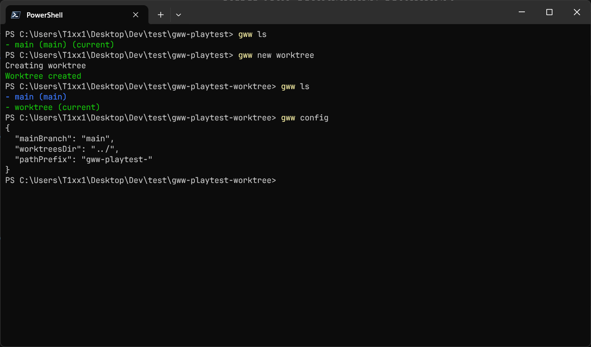

# Gww (Git Worktree Wrapper)

**Gww** is a PowerShell shell tool that wraps Git commands to provide an improved UX around Git worktrees, making multi-branch and multi-directory workflows way seamless.

This project was heavily inspired by the [git-worktree-runner by CodeRabbit](https://github.com/coderabbitai/git-worktree-runner).



## Features

- Better UX working with Git worktrees and worktreed branches
- Configs setup and postCreate script
- Configurable

## Requirements
- [PowerShell](https://learn.microsoft.com/it-it/powershell) 7+
- [Git](https://git-scm.com) 2.5+

## Installation (Windows)

```powershell
<# 1. Clone this repository #>
git clone https://github.com/t1xx1/gww.git

<# 2. Add Gww to $PATH #>
[System.Environment]::SetEnvironmentVariable("Path", ($env:Path + ";C:\Path\To\Gww"), "User")

<# 3. Open a new PowerShell window #>
wt nt -p "PowerShell"
exit
```

## Usage

```powershell
> gww <command> [<args>]
```

## Commands

Run `gww h` to log all the commands in your terminal or view the [Commands file](./src/cmds.txt).

## Config (`gww.config.json`)

The `gww.config.json` configures some aspects of Gww commands.

> Gww supports the config directory as `.config/gww.json` ([.config directory proposal](https://github.com/pi0/config-dir))

| Property         |          | Type                          | Desc                                                      | Default              |
| ---------------- | -------- | ----------------------------- | ----------------------------------------------------------| -------------------- |
| **mainBranch**   | required | `string`                      | Name of your primary branch                               | `main`               |
| **worktreesDir** | required | `string`                      | Relative directory for new worktrees                      | `../`                |
| **pathPrefix**   | required | `string`                      | Prefix for new worktree names                             | `<repository-name>-` |
| **configs**      | optional | `[string]`                    | List of config files that will be copied to new worktrees |                      |
| **postCreate**   | optional | `string`                      | Script to run after creating a worktree                   |                      |
| **checkout**     | optional | `"never"\|"prompt"\|"always"` | Whether to checkout to a newly created worktree           | `always`             |

<br />

### Happy parallel hacking!